# Development workflow

> Replace `{PROJECT-NAME}` and `{CLIENT-NAME}` with your actual project and client names
> throughout this document.

This page is the developer-facing overview for implementing a `{PROJECT-NAME}` slice from a fresh
`master` checkout through PR review and final completion. It complements
[`implementation-flow.md`](implementation-flow.md), which explains how requirements flow into the
repo and board, and [`implementation-slice-workflow.md`](implementation-slice-workflow.md), which
defines the detailed agent-slice mechanics.

Use this page when you need the operational sequence: who acts, which skill runs, when manual
validation happens, and how review feedback loops back into implementation.

## Responsibilities

- The developer starts from current `master`, manually validates the implementation, and confirms
  whether it is ready for review.
- The agent and implementation skills claim the slice, generate OpenSpec artifacts, implement with
  TDD, run automated checks, verify the work, and prepare the PR.
- The tester reviews and tests the PR, then either requests changes or merges the approved PR.
- The project board (e.g. Azure DevOps) and `openspec/track.md` are updated as the coordination
  record for the slice.

## Workflow diagram

```mermaid
flowchart TD
    START_NODE([Start]) --> CHECKOUT["[Developer]<br/>git checkout master<br/>(start from master)"]
    CHECKOUT --> PULL["[Developer]<br/>git pull<br/>Update local master"]

    PULL --> PICK[["[Skill]<br/>pick-implementation-slice<br/><br/>Validates master branch and latest state<br/>Finds an unclaimed feature requirement<br/>Claims it in track.md<br/>Creates project ticket<br/>Pushes track.md to master<br/>Creates and switches to a new branch"]]

    PICK --> SPEC[["[Skill]<br/>openspec-propose<br/><br/>Generates the OpenSpec change (proposal, design, tasks)<br/>Commits the specification files before code changes"]]

    SPEC --> TDD["[Agent]<br/>TDD implementation cycle<br/><br/>Generate tests<br/>Implement code<br/>Refine tests and implementation<br/>Repeat until the slice is implemented"]

    TDD --> RUN_TESTS["[Agent]<br/>Run automated tests"]
    RUN_TESTS --> VERIFY["[Agent]<br/>Verify implementation against specs,<br/>tests, and acceptance criteria"]

    VERIFY --> QUALITY_GATE{"[Agent]<br/>Quality gate passed?"}

    QUALITY_GATE -- "No" --> TDD
    QUALITY_GATE -- "Yes" --> PROMPT_DEV["[Agent]<br/>Request developer manual validation"]

    PROMPT_DEV --> MANUAL_TEST["[Developer]<br/>Manually test the implementation"]
    MANUAL_TEST --> DEV_CHANGES{"[Developer]<br/>Changes required?"}

    DEV_CHANGES -- "Yes" --> MODIFY["[Developer / Agent]<br/>Apply required changes"]
    MODIFY --> RUN_TESTS

    DEV_CHANGES -- "No" --> DEV_APPROVED{"[Developer]<br/>Implementation approved for review?"}

    DEV_APPROVED -- "No" --> MODIFY
    DEV_APPROVED -- "Yes" --> COMPLETE[["[Skill]<br/>complete-implementation-slice<br/><br/>Verifies and archives the OpenSpec change<br/>(openspec-archive-change, before the PR)<br/>Updates track.md<br/>Sets project ticket to In Review<br/>Pushes branch<br/>Creates Pull Request<br/>Adds required reviewers from tools/{project}-work/config.yaml<br/>(always reviewers, plus frontend reviewers if frontend was touched)"]]

    COMPLETE --> PR_REVIEW["[Tester]<br/>Review and test the Pull Request"]

    PR_REVIEW --> REVIEW_RESULT{"[Tester]<br/>Review approved?"}

    REVIEW_RESULT -- "No: comments or issues" --> HANDLE_COMMENTS["[Developer / Tester]<br/>Implement fixes or discuss comments<br/>until an agreement is reached"]
    HANDLE_COMMENTS --> PUSH_FIXES["[Developer / Agent]<br/>Commit and push updates"]
    PUSH_FIXES --> PR_REVIEW

    REVIEW_RESULT -- "Yes" --> MERGE["[Tester]<br/>Merge Pull Request into master"]

    MERGE --> DONE_STATUS["[Board / Track.md]<br/>Set project ticket to Completed<br/>Update track.md status to Completed"]

    DONE_STATUS --> END_NODE([End])

    classDef neutral fill:#f8fafc,stroke:#475569,stroke-width:1px,color:#0f172a;

    class START_NODE,CHECKOUT,PULL,PICK,SPEC,TDD,RUN_TESTS,VERIFY,QUALITY_GATE,PROMPT_DEV,MANUAL_TEST,DEV_CHANGES,MODIFY,DEV_APPROVED,COMPLETE,PR_REVIEW,REVIEW_RESULT,HANDLE_COMMENTS,PUSH_FIXES,MERGE,DONE_STATUS,END_NODE neutral;
```

