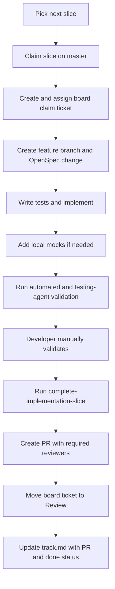

# Implementation slice workflow

> Replace `{PROJECT-NAME}` and `{CLIENT-NAME}` with your actual project and client names
> throughout this document.

This workflow coordinates parallel agent/developer implementation work for `{PROJECT-NAME}`. It
sits between the durable requirement model in `docs/requirements/`, OpenSpec changes under
`openspec/changes/`, and the project board (e.g. Azure DevOps).

## Principles

- `docs/requirements/` remains the source of truth for what the system must do.
- `openspec/changes/<change>/` is the implementation slice: proposal, design, tasks, specs, and
  validation evidence.
- `openspec/track.md` is the repository lock and progress ledger for active implementation slices.
- The project board is the human-visible coordination surface and receives one claim ticket per
  slice.
- The testing subagent validates implementation work independently before manual developer
  validation. Its final name is still pending and is represented by `TODO_TESTING_SUBAGENT_NAME`.
- The `Mock` environment (e.g. `ASPNETCORE_ENVIRONMENT=Mock`) is **local-only** and exists solely
  so a human can click through the frontend to test a slice while a real backend dependency is not
  yet available. `mock-implementation-slice` adds such mocks only when needed; they change nothing
  in other environments and never mark a requirement done.

## Slice lifecycle

### 1. Start from a clean worktree

1. Inspect `git status --porcelain`.
2. If there are uncommitted changes, including untracked files, stop. The workflow must not stash,
   clean, commit, or overwrite unrelated user work.
3. If the working tree is clean but the current branch is not `master`, ask the developer whether
   to check out `master` and continue.
4. If the developer approves, check out `master` and continue automatically. If the developer
   declines, stop.
5. Pull latest `master` with fast-forward only.
6. Read `tools/{project}-work/config.yaml` and `openspec/track.md`.

### 2. Pick the next slice

1. If `openspec/track.md` already has a row claimed by the current owner with incomplete claim
   steps (board ID `TBD`/`TODO`, missing branch, or missing OpenSpec artifacts), resume that claim
   instead of picking a new slice.
2. Run the deterministic selector to create the candidate queue:
   `.venv/bin/python3 .agents/skills/pick-implementation-slice/scripts/select_next_slice.py --top 25`.
3. The selector scans `docs/requirements/features/*.md`,
   `docs/requirements/requirements/*.md`, `tools/{project}-work/config.yaml`, and
   `openspec/track.md`.
4. It treats configured active track statuses (`claimed`, `in-progress`, `blocked`) and page-level
   `status: in-progress` as locks. `done` track rows and page-level `status: done` are completed
   implementation evidence. `abandoned` is not completed unless the requirement itself is
   independently marked done.
5. It ranks atomic requirement candidates by priority, tier, implementation risk, independence,
   existing codebase context, source confidence, and finally lowest `REQ-*` ID. This score is the
   deterministic input to selection, not an automatic final answer.
6. A parent feature's `csharp_status: done` (or equivalent) may resolve dependencies but does not
   by itself mark every child requirement implemented. Requirement-level evidence (`done` track row,
   `status: done`, `done` tag, or `openspec_change`) is needed to suppress a requirement candidate.
7. The agent reviews at least the top five selector rows, plus any user-mentioned candidate, by
   reading the serious candidates' requirement and feature pages and inspecting code/tests when
   metadata is ambiguous.
8. Pick the highest-ranked candidate that is application-implementable, independently testable,
   not mostly external/process work, not blocked by unresolved decisions, and not hiding a large
   unencoded dependency chain.
9. If the agent chooses a lower-ranked candidate, record each skipped higher-ranked candidate and
   its repo-backed skip reason in the claim notes.
10. Group additional requirements into the same slice only when they are necessary for the selected
   requirement, dependencies stay resolved or in the same small bundle, and the result remains
   reviewable as one PR.

### 3. Claim on master

1. Get the owner from git config.
2. Add a row to `openspec/track.md`.
3. Set requirement `owner`, `status: in-progress`, and the `in-progress` tag for affected
   requirement pages.
4. Set feature `implementation_owner`, `implementation_claim`, `status: in-progress`, and the
   `in-progress` tag.
5. Append `change_history` entries to edited MkDocs pages.
6. Run `.venv/bin/mkdocs build -f tools/requirements-site/mkdocs.yml --strict`; never push a claim
   that breaks the strict site build.
7. Commit the claim on `master`.
8. Push `master`.

If the push fails, pull latest `master`, re-check `openspec/track.md`, and either retry or select
the next candidate slice.

### 4. Create the project claim ticket

1. Use `tools/{project}-work/config.yaml` for the board URL and defaults.
2. Create or update the claim ticket through available board integration tools (e.g. Azure DevOps
   MCP tools).
3. If MFA is required, open the board in the browser and wait for the developer to log in.
4. Resolve the signed-in user, or ask the developer for their identity when the tooling cannot
   resolve it.
5. Assign the claim ticket to the calling user. Do not leave it silently unassigned.
6. Use the title format `{PROJECT-NAME} | <feature title>`.
7. Write the description in the structured format defined in `pick-implementation-slice`:
   opening business paragraph ("This claim covers the `{PROJECT-NAME}` `<feature>` ..."), an
   Implementation scope block (feature, requirements, OpenSpec path, owner, branch,
   `openspec/track.md`), boundary sentences for what stays outside the slice, and a Database
   impact section whenever an affected requirement carries DB necessities (create/extend/use/read
   with target tables).
8. Write acceptance criteria as Given/When/Then lines derived from the requirement pages,
   including the database acceptance criteria when the requirement has DB impact.
9. Add the board work item ID to `openspec/track.md`.
10. Commit and push that small `track.md` update on `master`.

### 5. Branch and generate OpenSpec

1. Create the implementation branch from updated `master` with the configured `feature/` prefix.
2. Push the branch when the board needs a remote ref.
3. Link the claim ticket to the branch and move it to the configured active state (e.g. `Approved`).
4. Build an OpenSpec context bundle from the selected feature and requirement pages before calling
   `openspec-propose`. Include relevant frontmatter, acceptance criteria, exclusions,
   source/evidence data, Source Atlas, Additional Context (project wiki), Database Description,
   Database Implementation, Data Migration, Coexistence, Architecture, and Technical Dependencies.
   DB and wiki sections are mandatory when present; preserve concrete values such as target tables,
   field names, constraints, event/topic names, catalogs, validation values, and database
   acceptance criteria.
5. Generate `openspec/changes/<change>/` by calling the `openspec-propose` skill with that context
   bundle.
6. Add `proposal.md`, `design.md`, `tasks.md`, and delta specs when required.
7. Include forward links from capability names to affected `REQ-*` IDs.
8. Include persistence design and migration/persistence validation tasks whenever the selected
   requirements carry DB necessities. Treat legacy SQL and wiki content as supporting
   implementation context, not as higher-priority requirements or deployable code.
9. Commit the OpenSpec artifacts before code changes.

### 6. Implement with TDD

1. Derive tests from acceptance criteria.
2. Use `generate-tdd-tests` to write failing tests first where practical.
3. Implement the smallest code change that satisfies the tests.
4. Refactor after tests pass.
5. Keep `tasks.md` current.
6. Add `openspec_change: <change>` to affected requirement frontmatter.
7. Populate `### Architecture` and `#### Technical Dependencies`.
8. Add or update `docs/requirements/test_cases/` pages where required.

### 7. Add local mocks for testing (only if needed)

After implementation and before the testing hand-off, run `mock-implementation-slice`. For each
requirement in the slice it applies a four-part gate — the behavior is frontend-observable, the
flow is blocked locally today because a real dependency is missing, a faithful mock is feasible
from existing types, and the real thing is not yet implemented — and adds a mock adapter and/or
local-DB seed **only when all four hold**. Mocks live only in the local-only `Mock` environment,
change nothing in other environments, and never mark a requirement done. Most slices add no mock.

### 8. Testing subagent hand-off

Call the testing subagent before manual validation.

Current placeholder:

```text
TODO_TESTING_SUBAGENT_NAME
```

The hand-off includes the OpenSpec change, feature ID, requirement IDs, changed files, commands
run, and the coverage expectation: aim for 100% meaningful business logic coverage while ignoring
getters, setters, DTO boilerplate, generated code, and trivial mappings unless they encode business
rules.

### 9. Manual validation

After automated checks and testing-subagent validation, ask the developer to manually validate the
slice. The developer response should be one of:

- approved
- approved with notes
- rejected

Rejected validation returns the slice to implementation.

### 10. Complete the slice

After developer approval, run `complete-implementation-slice`:

1. Verify OpenSpec tasks and traceability.
2. Create or update `openspec/changes/<change>/validation.md`.
3. Call `openspec-verify-change` for the change and stop if verification is unavailable or fails.
   After verification passes, archive the change with `openspec-archive-change` (before opening
   the PR) so the archive move is part of the PR diff; commit it with the completion metadata.
4. Set the feature `csharp_status: done` (or equivalent) and `status: done` when the
   implementation covers the selected feature/slice.
5. Mark affected requirement pages done for implementation by setting `status: done`, removing
   transient `in-progress` tags, and adding a `done` tag when real implementation covers them.
6. Update the board claim ticket to the configured review state, not `Done`.
7. Update `openspec/track.md` to `done`, with completion date, validation summary, and PR
   `pending`.
8. Commit those completion metadata changes before pushing the branch and before creating the PR.
   Stop instead of creating the PR if the requirement pages, `openspec/track.md`, or board claim
   ticket still show the slice as in progress.
9. Create the PR with requirement, OpenSpec, board, test, and manual-validation evidence.
10. Add the required PR reviewers configured in `tools/{project}-work/config.yaml`
   (`pull_request.required_reviewers`): the `always` reviewers on every PR, plus the `frontend`
   reviewers when the slice touches frontend behavior. The config file is the single source of
   truth for reviewer names.

## Workflow diagrams

### Simple workflow



### Detailed workflow

```mermaid
flowchart TD
    A[Start on master] --> B[Pick next FEAT/REQ slice]
    B --> C{Claim exists in track.md?}
    C -- Yes --> B
    C -- No --> D[Update MkDocs claim metadata and track.md]
    D --> E[Commit and push claim on master]
    E --> F{Push succeeded?}
    F -- No --> B
    F -- Yes --> G[Create board claim ticket]
    G --> H[Commit board ID to track.md on master]
    H --> I[Create implementation branch]
    I --> J[Generate and commit OpenSpec]
    J --> K[TDD implementation]
    K --> K2[Add local mocks if needed]
    K2 --> L[Call testing subagent placeholder]
    L --> M{Automated validation passed?}
    M -- No --> K
    M -- Yes --> N[Ask developer for manual validation]
    N --> O{Developer approved?}
    O -- No --> K
    O -- Yes --> P[Run complete-implementation-slice]
    P --> Q[Verify tasks, traceability, and checks]
    Q --> R[Write validation.md evidence]
    R --> S[Call openspec-verify-change]
    S --> T{Verification succeeded?}
    T -- No --> U[Stop and report blocker]
    T -- Yes --> V[Update MkDocs completion metadata]
    V --> W[Set board ticket to Review]
    W --> X[Prepare PR body]
    X --> Y[Add configured always-required reviewers]
    Y --> Z{Touches frontend?}
    Z -- Yes --> AA[Add configured frontend reviewers]
    Z -- No --> AB[Keep backend/general reviewer set]
    AA --> AC{All reviewers resolved?}
    AB --> AC
    AC -- No --> AD[Stop and report unresolved reviewer]
    AC -- Yes --> AE[Create PR]
    AE --> AF[Link PR in board and track.md]
    AF --> AG[Commit and push completion metadata]
```



## Open points

- Replace `TODO_TESTING_SUBAGENT_NAME` once the testing subagent branch is merged.
- Decide whether `implementation_owner` and `implementation_claim` should be rendered on the
  requirements site or remain invisible coordination metadata.
