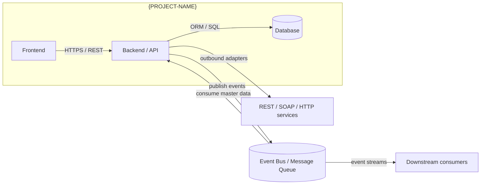

# APIs and Topics

This page records repository-local evidence for external APIs or services that {PROJECT-NAME} appears to call, publish to, consume from, or depend on. It separates confirmed requirement evidence, backlog evidence, architecture wiki evidence, and the current implementation surface in one matrix.

## Communication map

Replace this section with a Mermaid diagram showing the system's communication topology. Example:

## Evidence table

Replace this section with a table of external services, their evidence sources (requirements, backlog tickets, architecture docs, code analysis), and current implementation status.

| External service | Requirements evidence | Backlog evidence | Architecture evidence | Code evidence |
|---|---|---|---|---|
| {Service Name} | [REQ-EXAMPLE-001](requirements/REQ-EXAMPLE-001.md) | {Ticket IDs} | {Wiki / ADR reference} | {C# / code surface found} |

## Current gaps

List external service integrations that have evidence (requirement, ticket, architecture) but no confirmed current code adapter — these are implementation gaps to track.

- {Service}: requirement evidence exists, no adapter found in current code scan.
